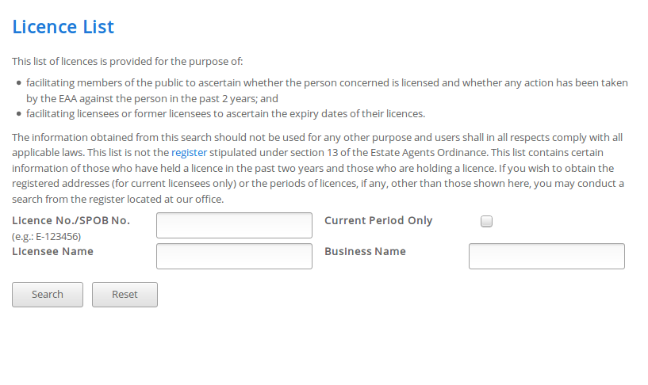
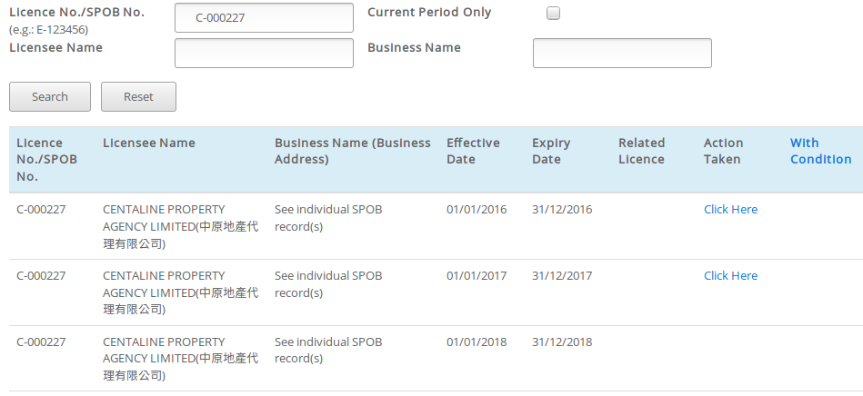

# EAAScraper

This bot demonstrates the techniques of obtaining data in a brute-force manner. Please note that this project is purely for academic purpose, any data obtained form the sample website belongs to its owner. DO NOT NUKE THE WEBSITE.

## Quickstart
Change the database in EAAScraper/settings.py to your MongoDB settings. Default configuration:
```python
MONGO_URI = 'mongodb://localhost:27017/'
MONGO_DATABASE = 'eaa'
MONGO_COLLECTION = 'companies'
```
After setting up, run:
```bash
service mongod start
cd EAAScraper
pip install -r requirements.txt
scrapy crawl eaa
```

## Key techniques
1. Submitting multipart/form-data
2. Bypassing session authentication - the example site uses pre-negotiated values for form requests
3. Using generators instead of pre-computed list to obtain all possible input
4. Inserting valid records into MongoDB using pipelines

## Explanation
This scraper scrapes from [Estate Agents Authority](http://www.eaa.org.hk/en-us/licence-search) to look for real estate agents in Hong Kong.



In the normal manual way, you get the result by inputting a valid licence number in the form.



The spider loops through all possible licence number and submit form requests. For the sake of demonstration purpose, we only loop on one alphabet by default.
